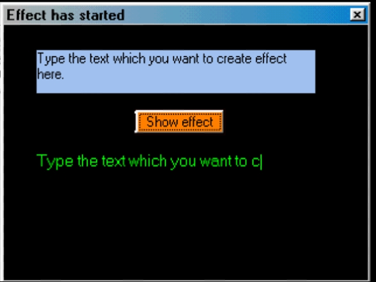



## Type writer effect for cool status display

### Description

This code allow you to create a type writer effect. Ideal for displaying user friendly status of your software.
 
### More Info
 
Just pass the text you want to creat effect and the object name to display the effect in real time.

Anyone one can understand it as it is well commanded and clearly writen

The function returns true untill the effect has completed

             |
---                |---
**Submitted On**   |1997-01-01 13:56:24
**By**             |[N Satheesh KUmar](https://github.com/Planet-Source-Code/PSCIndex/blob/master/ByAuthor/n-satheesh-kumar.md)
**Level**          |Beginner
**User Rating**    |3.7 (11 globes from 3 users)
**Compatibility**  |VB 5\.0, VB 6\.0
**Category**       |[Graphics](https://github.com/Planet-Source-Code/PSCIndex/blob/master/ByCategory/graphics__1-46.md)
**World**          |[Visual Basic](https://github.com/Planet-Source-Code/PSCIndex/blob/master/ByWorld/visual-basic.md)
**Archive File**   |[Type\_write14482210112002\.zip](https://github.com/Planet-Source-Code/n-satheesh-kumar-type-writer-effect-for-cool-status-display__1-39736/archive/master.zip)

